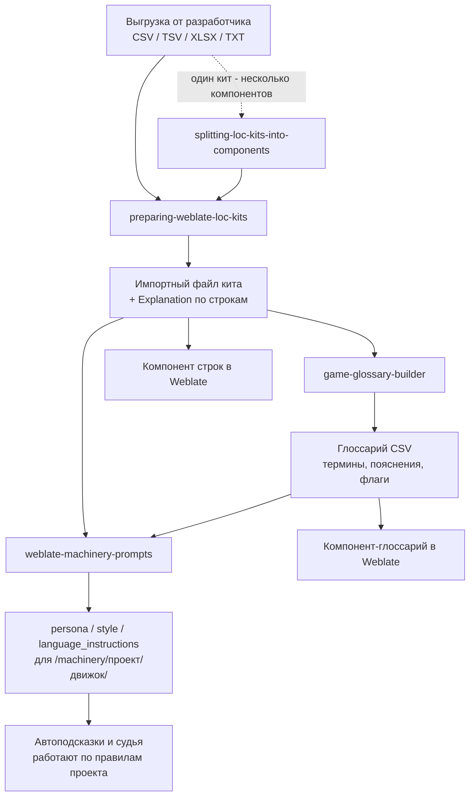

# Как скиллы работают вместе

Порядок не произвольный: каждый следующий скилл опирается на артефакт
предыдущего. Пропущенный шаг всплывает позже - неверным исходным языком,
потерянным языком или промптом, который спорит с глоссарием.

## Шаг 1. `preparing-weblate-loc-kits`

Превращает выгрузку в файл, который принимает интерфейс создания компонента
HCGameLoc. Здесь решается то, что потом нельзя переиграть: **исходный язык**
(в Weblate он неизменяемый - ошибка означает пересоздание компонента), точные
коды языков, что делать с легаси-колонками и колонкой пояснений.

Исходный язык по умолчанию **русский**: киты Hero Craft пишутся на русском,
поэтому скилл не спрашивает его заново, а просит подтвердить и фиксирует
допущение в отчёте. Уйти от `ru` он может только по прямому указанию человека
или если сам кит противоречит допущению - выводить язык из порядка и
заполненности колонок по-прежнему запрещено.

Результат: импортный файл кита. Проверка готовности - `loc_kit_ingest`, а не
«файл открылся в Excel».

## Шаг 1a. `splitting-loc-kits-into-components`

Нужен только тогда, когда один кит должен стать несколькими компонентами -
например действующий компонент разделяют на UI, Dialogues и Tutorial. Шаг 1
задаёт схему каждого выходного файла, шаг 1a решает, какая строка в какой файл
попадает, и доказывает, что при этом ничего не изменилось.

Два решения принимает человек, а не скилл: **правило границы** (якорь по
началу ключа, лист книги, колонка группы или внешний артефакт движка) и
**компонент-остаток** для ключей, не подошедших ни под один якорь. Скилл
приносит на это решение измерения - сколько строк в каждом компоненте и
полный список семейств, где якорь и смысл расходятся. Если в ките нет никакого
сигнала группировки, скилл останавливается и просит артефакт вместо того,
чтобы придумать корзины по содержимому строк.

Проверка результата - не «сумма строк сошлась», а поячеечная сверка через тот
же ридер, которым читает импортёр, плюс отдельный прогон `loc_kit_ingest` по
каждому выходному файлу: строка, пустая во всех языках, отклоняет весь файл, а
исходный язык определяется первой языковой колонкой и после создания
компонента неизменяем.

Результат: N импортных файлов, файл карантина и отчёт с арифметикой
`вход = компоненты + карантин`.

## Шаг 2. `game-glossary-builder`

Собирает глоссарий по тому же киту: термины, переводы на все целевые языки,
пояснения и - отдельным решением продюсера - флаги (`exact`, `forbidden`,
`read-only`, `terminology`).

Почему это отдельный артефакт, а не часть промпта: при импортированном
глоссарии Weblate отправляет термины вместе с каждым запросом к модели, с
пояснениями. Термин в промпте оплачивался бы дважды и стал бы вторым,
расходящимся источником истины.

## Шаг 3. `weblate-machinery-prompts`

Читает кит и глоссарий как доказательную базу и пишет три поля проекта:
`persona`, `style`, `language_instructions`. Ничего не деплоит - выдаёт текст,
который продюсер вставляет в форму `/machinery/<проект>/<движок>/`.

Ключевая механика, из которой выведены все правила скилла: `persona` и `style`
читает не только переводчик, но и LLM-судья - они подставляются в его роль
аннотатора, поэтому любое утверждение там становится критерием ревью.
`language_instructions` судья не видит вообще, там живёт типографика и
грамматика конкретного языка.

## Что нужно от человека на каждом шаге

Скиллы не угадывают факты о продукте. Каждый начинает с короткого интервью на
русском и останавливается, если ответа нет:

| Шаг | Что обязан подтвердить человек |
|---|---|
| Кит | исходный язык (по умолчанию `ru`, нужно только подтвердить), состав и смысл колонок, судьба легаси-полей |
| Глоссарий | границы терминологии, флаги-исключения, спорные переводы |
| Промпты | текущие значения полей в форме, регистр и политика мата, состояние глоссария |

## Границы

- Скиллы работают с файлами. Они не опрашивают живой Weblate, не переводят
  пустые ячейки, не покупают вызовы модели и ничего не деплоят без отдельного
  разрешения.
- Пояснения к строкам (`Explanation`) и промпты проекта - разные артефакты:
  первое про одну строку, второе про весь проект.
- Все три скилла написаны под контракты HCGameLoc (форк Weblate для Hero
  Craft). В чужом Weblate часть проверок и путей не совпадёт.
