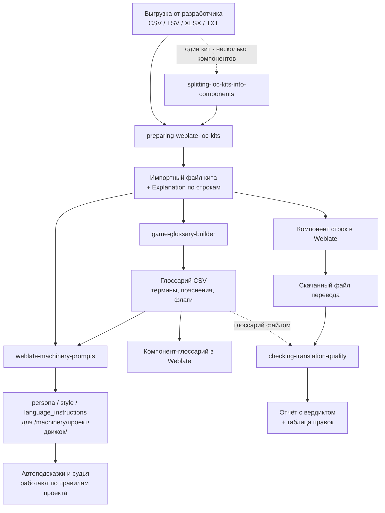

# Как скиллы работают вместе

Порядок не произвольный: каждый следующий скилл опирается на артефакт
предыдущего. Пропущенный шаг всплывает позже - неверным исходным языком,
потерянным языком или промптом, который спорит с глоссарием.

Шаги 1-3 можно пройти по одному, а можно отдать мастеру
`setting-up-weblate-projects` (шаг 0 ниже): он зовёт те же скиллы сам и
доводит результат до сервера.

```mermaid
flowchart TD
    A[Выгрузка от разработчика<br/>CSV / TSV / XLSX / TXT] --> B[preparing-weblate-loc-kits]
    A -. один кит - несколько компонентов .-> S[splitting-loc-kits-into-components]
    S --> B
    B --> C[Импортный файл кита<br/>+ Explanation по строкам]
    C --> D[game-glossary-builder]
    D --> E[Глоссарий CSV<br/>термины, пояснения, флаги]
    C --> F[weblate-machinery-prompts]
    E --> F
    F --> G[persona / style / language_instructions<br/>для /machinery/проект/движок/]
    C --> H[Компонент строк в Weblate]
    E --> I[Компонент-глоссарий в Weblate]
    G --> J[Автоподсказки и судья<br/>работают по правилам проекта]
    H --> K[Скачанный файл перевода]
    E -. глоссарий файлом .-> L
    K --> L[checking-translation-quality]
    L --> M[Отчёт с вердиктом<br/>+ таблица правок]
```

## Шаг 1. `preparing-weblate-loc-kits`

Превращает выгрузку в файл, который принимает интерфейс создания компонента
HCGameLoc. Здесь решается то, что потом нельзя переиграть: **исходный язык**
(в Weblate он неизменяемый - ошибка означает пересоздание компонента), точные
коды языков, что делать с легаси-колонками и колонкой пояснений.

Исходный язык выбирает продюсер между **русским** и **английским**, и скилл
кладёт на стол оба варианта с ценой каждого. Русский - быстрее и удобнее в
ежедневной работе: оригинал, пояснения, глоссарий, сообщения проверок и
промпты подсказок остаются на языке команды, между оригиналом и переводами нет
лишнего звена. Английский - потенциально выше качество на части языков:
внешние подрядчики и модели переводят с английского лучше, чем с русского, но
английский придётся писать и вычитывать как настоящий оригинал, иначе каждый
перевод унаследует машинный пивот с русского. Без ответа импортный файл не
пишется, а выводить язык из порядка и заполненности колонок по-прежнему
запрещено.

Результат: импортный файл кита. Проверка готовности - `loc_kit_ingest`, а не
«файл открылся в Excel».

## Шаг 1a. `splitting-loc-kits-into-components`

Нужен только тогда, когда один кит должен стать несколькими компонентами -
например действующий компонент разделяют на UI, Dialogues и Tutorial. Шаг 1
задаёт схему каждого выходного файла, шаг 1a решает, какая строка в какой файл
попадает, и доказывает, что при этом ничего не изменилось.

Два решения принимает человек, а не скилл: **правило границы** (якорь по
началу ключа, лист книги, колонка группы или внешний артефакт движка) и
**компонент-остаток** для ключей, не подошедших ни под один якорь. Скилл
приносит на это решение измерения - сколько строк в каждом компоненте и
полный список семейств, где якорь и смысл расходятся. Если в ките нет никакого
сигнала группировки, скилл останавливается и просит артефакт вместо того,
чтобы придумать корзины по содержимому строк.

Проверка результата - не «сумма строк сошлась», а поячеечная сверка через тот
же ридер, которым читает импортёр, плюс отдельный прогон `loc_kit_ingest` по
каждому выходному файлу: строка, пустая во всех языках, отклоняет весь файл, а
исходный язык определяется первой языковой колонкой и после создания
компонента неизменяем.

Результат: N импортных файлов, файл карантина и отчёт с арифметикой
`вход = компоненты + карантин`.

## Шаг 2. `game-glossary-builder`

Собирает глоссарий по тому же киту: термины, переводы на все целевые языки,
пояснения и - отдельным решением продюсера - флаги (`exact`, `forbidden`,
`read-only`, `terminology`).

Почему это отдельный артефакт, а не часть промпта: при импортированном
глоссарии Weblate отправляет термины вместе с каждым запросом к модели, с
пояснениями. Термин в промпте оплачивался бы дважды и стал бы вторым,
расходящимся источником истины.

## Шаг 3. `weblate-machinery-prompts`

Читает кит и глоссарий как доказательную базу и пишет три поля проекта:
`persona`, `style`, `language_instructions`. Ничего не деплоит - выдаёт текст,
который продюсер вставляет в форму «Операции» -> «Автоматические предложения»
-> «Настроить». От продюсера нужен только кит: движок, слаг проекта, путь к
репозиторию и текущие значения полей скилл не спрашивает.

Ключевая механика, из которой выведены все правила скилла: `persona` и `style`
читает не только переводчик, но и LLM-судья - они подставляются в его роль
аннотатора, поэтому любое утверждение там становится критерием ревью.
`language_instructions` судья не видит вообще, там живёт типографика и
грамматика конкретного языка.

## Шаг 4. `checking-translation-quality`

Проверяет готовый перевод, который продюсер скачал из Weblate, и отвечает на
вопрос «можно ли это отдавать». Звать можно на любом переводе, не проходя
предыдущие шаги; глоссарий из шага 2 добавляет проверку терминов, без него
термины в отчёте помечены как непроверенные.

Балл качества считается по методике MQM скриптом, а не агентом: 1, 5 и 25
штрафных очков за мелкую, серьёзную и критичную ошибку на слово проверенного
оригинала. Итоговая оценка выдаётся только при проверке всех строк, одна
критичная ошибка блокирует файл при любом балле. Отчёт не содержит советов по
настройке платформы - только что не так в тексте и как это исправить.

Результат: отчёт и таблица правок XLSX рядом с проверенным файлом.

## Шаг 0. `setting-up-weblate-projects`

Мастер для продюсера, у которого на руках пак от команды игры в любом виде:
таблица строк, глоссарий, промпты по языкам, гайд, описание игры, скриншоты,
иногда только одна выгрузка. Первым сообщением скилл предупреждает, что для
публикации нужен API-ключ учётной записи с правом создавать проекты, и,
пока ключа нет, разбирает материалы скриптом `inspect_inputs.py`: роль каждого
файла, назначение каждой колонки, чего не хватает. Смысл колонок он выводит
из данных сам и спрашивает только там, где значения его не показывают.

Вопросы продюсеру приходят не больше чем тремя сообщениями на весь прогон:
блокеры (исходный язык, название, языки при неоднозначности), затем найденные
в данных проблемы одной таблицей, затем план публикации. Интервью шагов 1-3
не повторяются: ответы лежат в `decisions.md` и передаются скиллам.

Дальше скилл зовёт шаги 1-3, собирает из их результатов файлы для сервера
(`build_upload.py` рендерит те же PO и TBX, что `loc_kit_ingest`, и сверяет их
поячеечно) и после явного «да» публикует через API (`publish.py`): проект с
включённым рецензированием, глоссарий, компонент строк, пояснения, флаги
терминов, промпты `openrouter`. В конце сверка сервера с манифестом и отчёт.
Проверить приватность проекта нужно руками: API эту настройку не видит.

Результат: живой проект на сервере и `weblate-setup/ОТЧЁТ.md` рядом с паком.

## Что нужно от человека на каждом шаге

Скиллы не угадывают факты о продукте. Каждый начинает с короткого интервью на
русском и останавливается, если ответа нет:

| Шаг | Что обязан подтвердить человек |
|---|---|
| Мастер | API-ключ и право создавать проекты; исходный язык; название; ответы на вопросы шагов ниже, которых нет в материалах; «да» на план публикации |
| Кит | исходный язык - выбор между `ru` и `en` с их последствиями, состав и смысл колонок, судьба легаси-полей |
| Глоссарий | границы терминологии, флаги-исключения, спорные переводы |
| Промпты | исходный язык, обращение к игроку, политика грубости - не больше трёх вопросов, у каждого предложенный по киту ответ |
| Проверка качества | файл перевода; при нескольких языках - какой проверять, какая колонка оригинал; глоссарий, если есть; при файле больше 1000 строк - все или часть |

## Границы

- Шаги 1-4 работают с файлами. Они не опрашивают живой Weblate, не переводят
  пустые ячейки, не покупают вызовы модели и ничего не деплоят без отдельного
  разрешения. Проверка качества по ссылке и API-ключу от продюсера может
  прочитать строки перевода с сервера, ничего там не меняя. Мастер пишет на
  сервер: создаёт только новый проект и только после «да» на показанный план.
- Пояснения к строкам (`Explanation`) и промпты проекта - разные артефакты:
  первое про одну строку, второе про весь проект.
- Все скиллы написаны под контракты HCGameLoc (форк Weblate для Hero
  Craft). В чужом Weblate часть проверок и путей не совпадёт.
